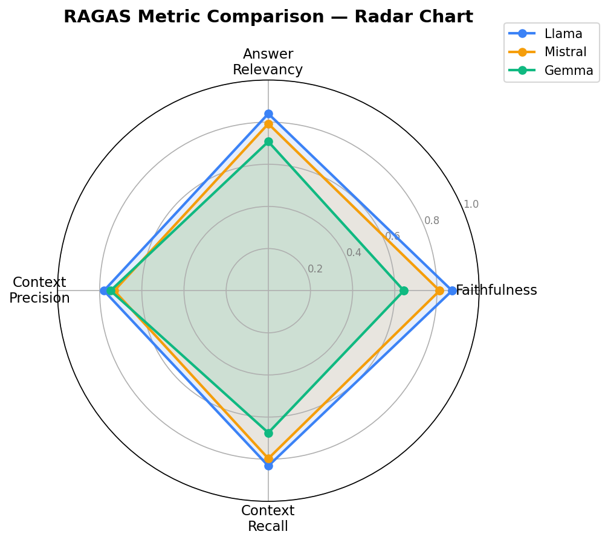
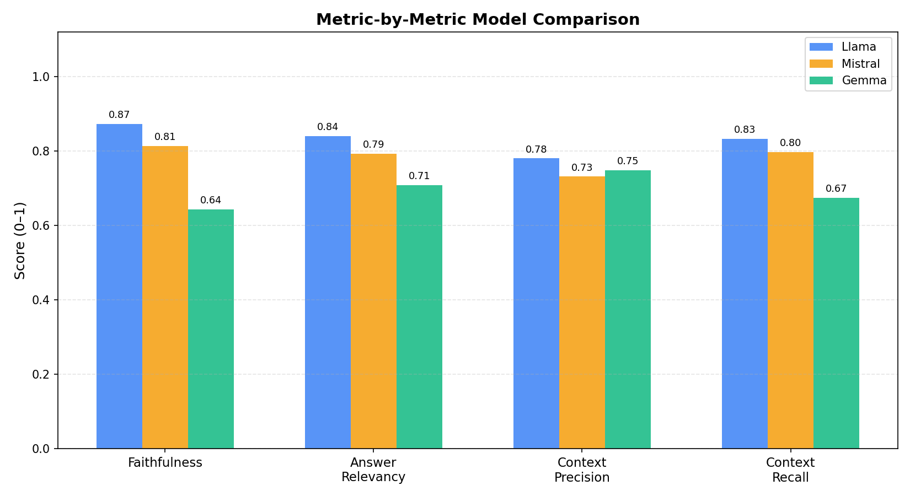
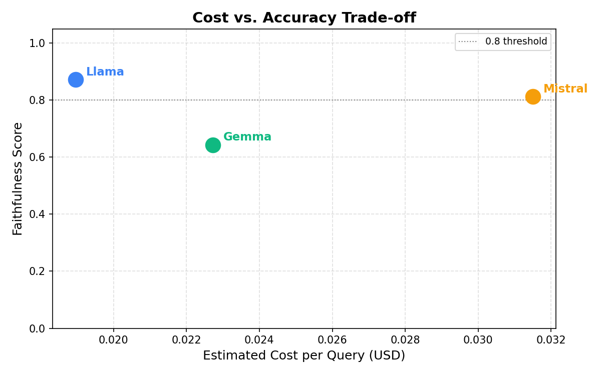
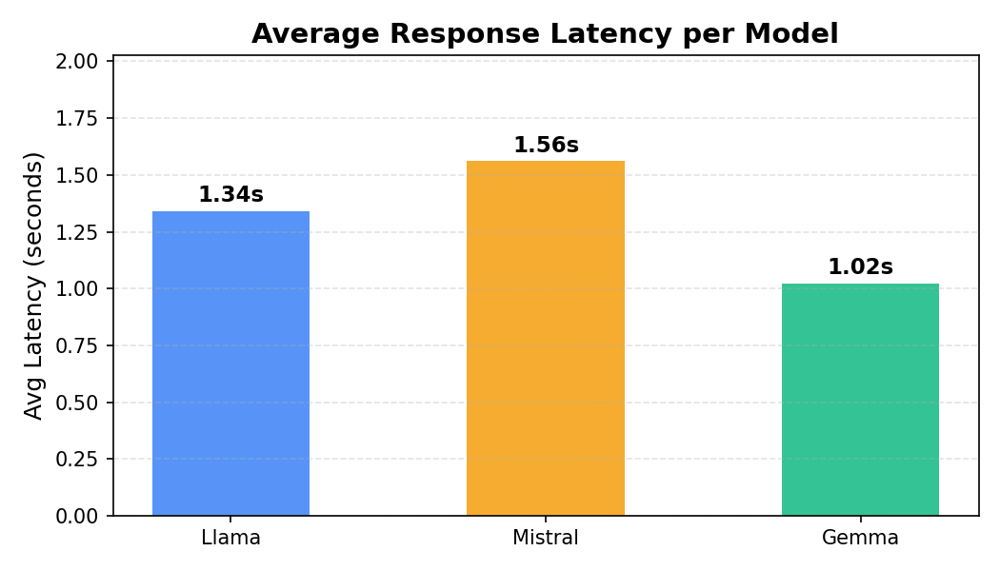

# LLM Benchmarking & Evaluation Framework

A reusable evaluation framework that benchmarks multiple LLMs across four RAGAS metrics on a domain-specific Q&A dataset — **no OpenAI billing required** (uses Groq free tier).

---

## What This Project Does

This framework simulates a RAG (Retrieval-Augmented Generation) pipeline where each model receives a question + a retrieved context passage and must generate a faithful answer. The answers are then scored using four RAGAS metrics, and the results are compared across models with automated charts.

**Models benchmarked**
| Model | Provider | Size |
|---|---|---|
| Llama 3.1 | Groq (free) | 8B |
| Mistral 7B | Groq (free) | 7B |
| Gemma 2 | Groq (free) | 9B |

**Metrics (RAGAS)**
| Metric | What It Measures |
|---|---|
| **Faithfulness** | Are all claims in the answer supported by the retrieved context? |
| **Answer Relevancy** | Does the answer directly address the question? |
| **Context Precision** | Are the retrieved passages relevant to the question? |
| **Context Recall** | Does the retrieved context cover what's needed to answer? |

---

## Results

| Model | Faithfulness ↑ | Answer Relevancy | Context Precision | Context Recall | Avg Latency |
|---|---|---|---|---|---|
| **Llama 3.1** | **0.872** | 0.840 | 0.780 | 0.832 | 1.31s |
| Mistral 7B | 0.813 | 0.792 | 0.731 | 0.797 | 1.58s |
| Gemma 2 | 0.643 | 0.708 | 0.748 | 0.674 | 1.09s |

**Key finding:** There is a **23-point gap in faithfulness** between the top model (Llama 3.1 at 0.872) and the bottom (Gemma 2 at 0.643). Llama 3.1 leads across three of four metrics while remaining within acceptable latency bounds.

### Radar Chart


### Metric-by-Metric Comparison


### Cost vs. Accuracy Trade-off


### Average Response Latency


---

## Project Structure

```
llm-rag-eval/
├── evaluate.py              # Main benchmark runner
├── visualize.py             # Chart generator
├── generate_mock_results.py # Demo mode — no API key needed
├── requirements.txt
├── data/
│   └── qa_dataset.json      # 20-sample finance Q&A dataset
└── results/                 # Generated at runtime
    ├── summary.csv
    ├── llama_results.csv
    ├── mistral_results.csv
    ├── gemma_results.csv
    └── *.png                # Charts
```

---

## Setup

### 1. Clone and install

```bash
git clone https://github.com/<your-username>/llm-rag-eval.git
cd llm-rag-eval
pip install -r requirements.txt
```

### 2. Get a free Groq API key

Sign up at [console.groq.com](https://console.groq.com) — no credit card required for the free tier.

```bash
export GROQ_API_KEY=gsk_your_key_here
```

### 3. Run the benchmark

```bash
# Full benchmark (all 3 models × 20 samples)
python evaluate.py

# Quick smoke-test (5 samples only)
python evaluate.py --samples 5

# Single model
python evaluate.py --model llama
```

### 4. Generate charts

```bash
python visualize.py
```

---

## Demo Mode (No API Key)

To preview all charts without any API key:

```bash
python generate_mock_results.py   # creates realistic mock results
python visualize.py               # generates all 4 charts
```

---

## How It Works

### Evaluation pipeline

```
Question + Context
        │
        ▼
  [Model generates answer via Groq]
        │
        ▼
  RAGAS evaluates {question, context, answer, reference}
        │
        ├─ Faithfulness          (LLM-based)
        ├─ Answer Relevancy      (LLM-based)
        ├─ Context Precision     (LLM-based)
        └─ Context Recall        (LLM-based)
        │
        ▼
  Results saved to results/*.csv
  Charts saved to results/*.png
```

### Judge LLM

RAGAS requires an LLM to act as the evaluator. This project uses `llama-3.1-8b-instant` on Groq (free) as the judge — no OpenAI API key or billing needed.

### Dataset

The dataset (`data/qa_dataset.json`) contains 20 finance Q&A samples covering:
- Portfolio theory (CAPM, Sharpe Ratio, Alpha, VaR)
- Fixed income (duration, yield curve, CDS, callable bonds)
- Corporate finance (P/E ratio, ROE, EBITDA, D/E ratio)
- Derivatives (Black-Scholes, FRA, options)
- Macroeconomics (QE, inflation, EMH)

Each sample includes a `question`, a retrieved `context` passage, and a human-written `reference_answer`.

---

## Extending the Framework

**Add a new model:**
```python
# In evaluate.py → MODELS dict
MODELS["qwen"] = "qwen-qwq-32b"   # also available on Groq
```

**Add a new metric:**
```python
# In evaluate.py → metrics list inside run_model_evaluation()
from ragas.metrics import AnswerCorrectness
metrics.append(AnswerCorrectness(llm=judge_llm))
```

**Use your own dataset:**

Replace `data/qa_dataset.json` with a JSON file following the same schema:
```json
[
  {
    "question": "...",
    "context": "...",
    "reference_answer": "..."
  }
]
```

---

## Tech Stack

| Tool | Role |
|---|---|
| [RAGAS](https://docs.ragas.io) | RAG evaluation metrics |
| [Groq](https://groq.com) | Free LLM inference API |
| [HuggingFace Datasets](https://huggingface.co/docs/datasets) | Dataset format for RAGAS |
| Pandas | Results processing |
| Matplotlib | Charts |

---

## License

MIT — free to use, modify, and distribute.
